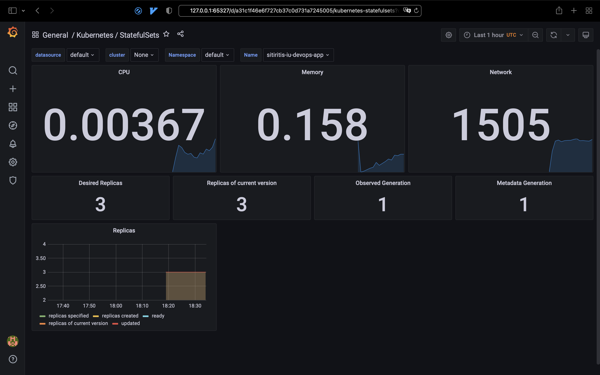
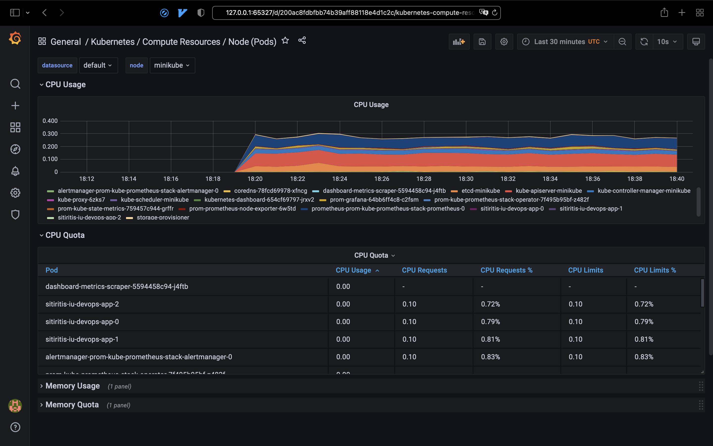
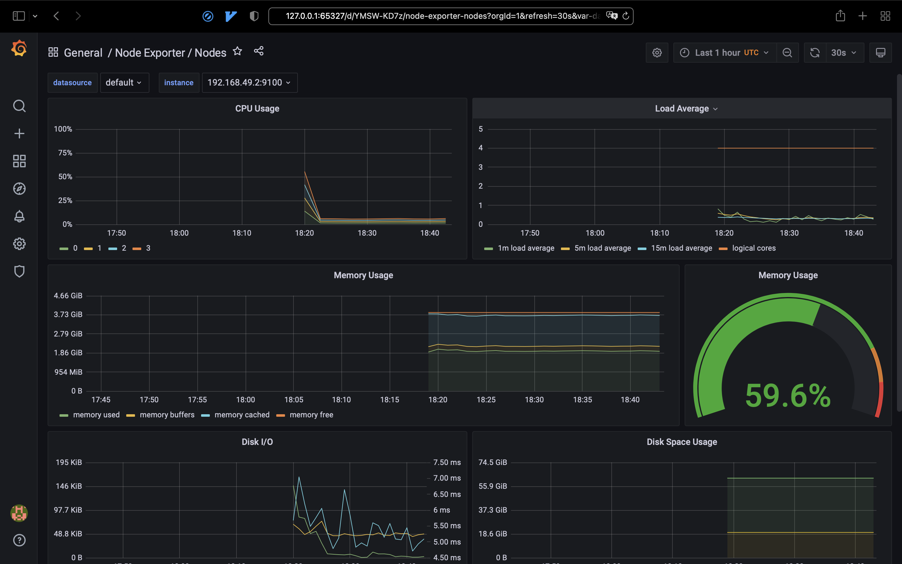
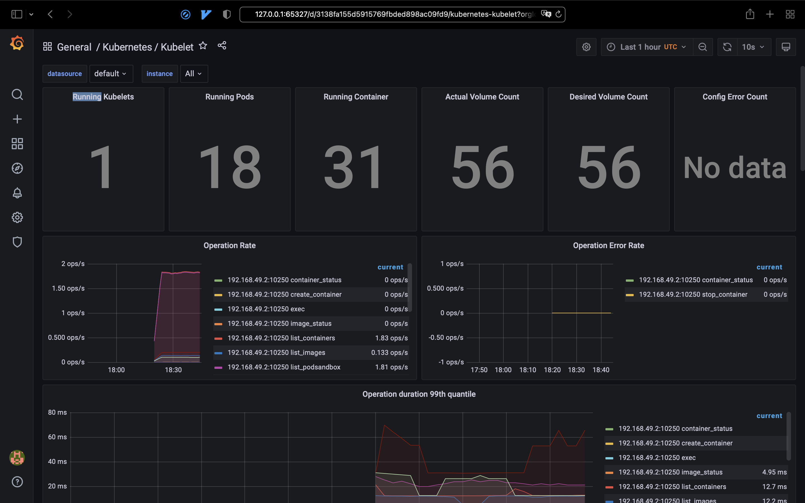
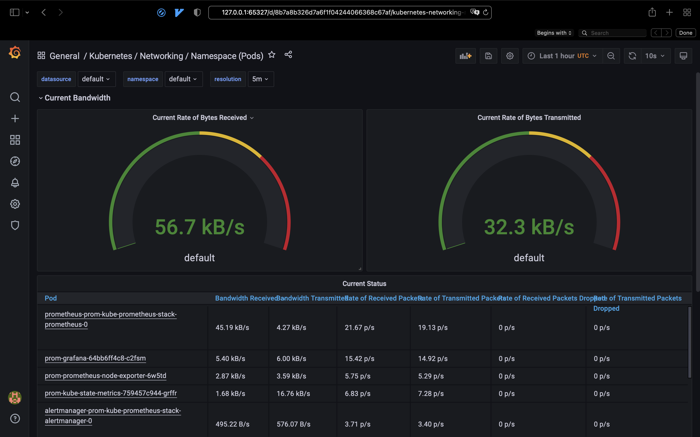
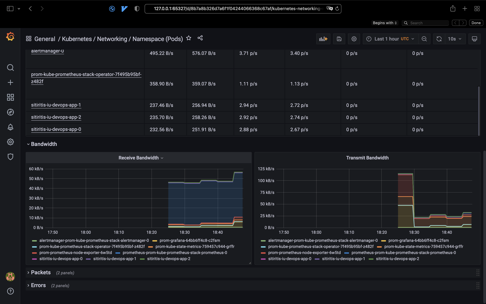
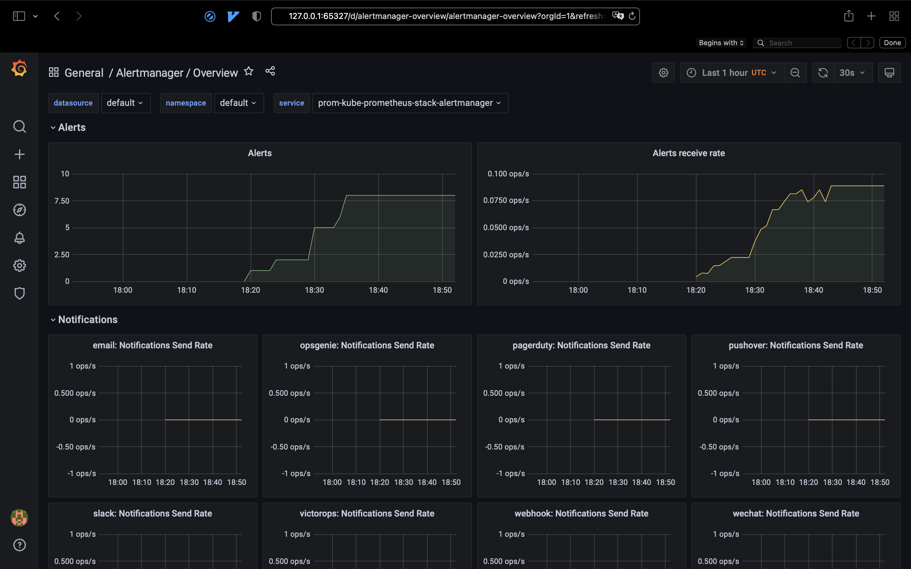
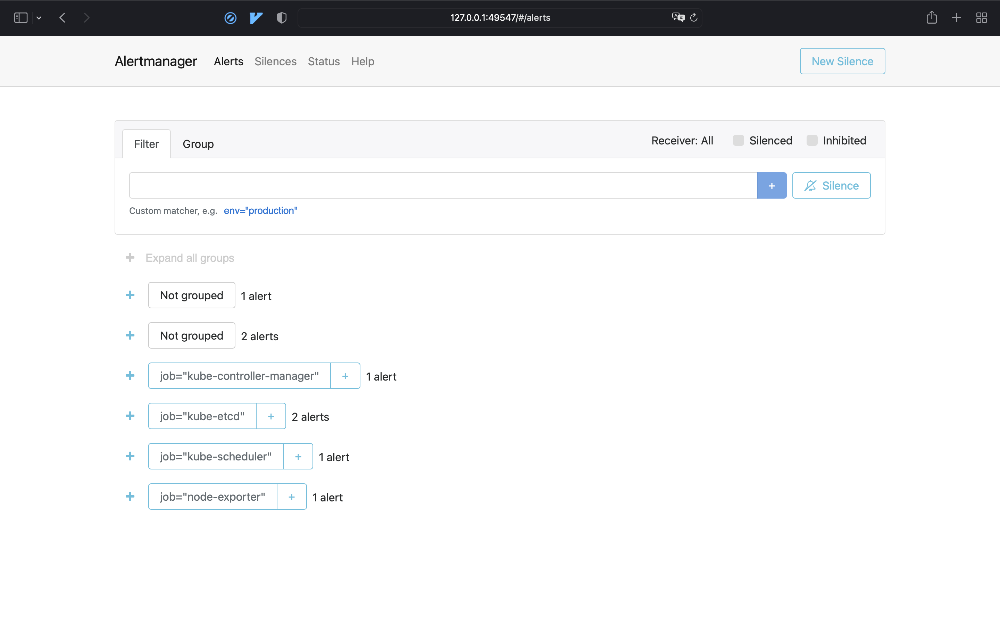

# k8s cluster monitoring

## Kube prom stack components

- [Prometheus Operator](https://github.com/prometheus-operator/prometheus-operator) - deploys and manages prometheus and related components
- [Prometheus](https://prometheus.io) - time-series database and service that scraps metrics from the configured endpoint
- [Alertmanager](https://github.com/prometheus/alertmanager) - service for sending alerts to the specified channels
- [Prometheus node-exporter](https://github.com/prometheus/node_exporter) - application that exports prometheus metrics about the machine it is running on and the os
- [Prometheus Adapter for Kubernetes Metrics APIs](https://github.com/kubernetes-sigs/prometheus-adapter) - prometheus implementation of the `custom.metrics.k8s.io` API to retrieve k8s cluster metrics
- [kube-state-metrics](https://github.com/kubernetes/kube-state-metrics) - k8s cluster metrics exporter
- [Grafana](https://grafana.com) - UI to visualize metrics and logs

## Installing `kube-prometheus-stack` helm chart

1. Add the repository
   ```shell
   helm repo add prometheus-community https://prometheus-community.github.io/helm-charts
   helm repo update
   ```
2. 
   ```shell
   helm install prom prometheus-community/kube-prometheus-stack
   ```
3. Check the cluster state with `kubectl get po,sts,svc,pvc,cm`:
   ```
   NAME                                                         READY   STATUS            RESTARTS   AGE
   pod/alertmanager-prom-kube-prometheus-stack-alertmanager-0   2/2     Running           0          41s
   pod/prom-grafana-64bb6ff4c8-c2fsm                            2/2     Running           0          57s
   pod/prom-kube-prometheus-stack-operator-7f495b95bf-z482f     1/1     Running           0          57s
   pod/prom-kube-state-metrics-759457c944-grffr                 1/1     Running           0          57s
   pod/prom-prometheus-node-exporter-6w5td                      1/1     Running           0          57s
   pod/prometheus-prom-kube-prometheus-stack-prometheus-0       0/2     PodInitializing   0          41s
   pod/sitiritis-iu-devops-app-0                                1/1     Running           0          20h
   pod/sitiritis-iu-devops-app-1                                1/1     Running           0          20h
   pod/sitiritis-iu-devops-app-2                                1/1     Running           0          20h
   
   NAME                                                                    READY   AGE
   statefulset.apps/alertmanager-prom-kube-prometheus-stack-alertmanager   1/1     41s
   statefulset.apps/prometheus-prom-kube-prometheus-stack-prometheus       0/1     41s
   statefulset.apps/sitiritis-iu-devops-app                                3/3     20h
   
   NAME                                              TYPE        CLUSTER-IP       EXTERNAL-IP   PORT(S)                      AGE
   service/alertmanager-operated                     ClusterIP   None             <none>        9093/TCP,9094/TCP,9094/UDP   41s
   service/kubernetes                                ClusterIP   10.96.0.1        <none>        443/TCP                      15d
   service/prom-grafana                              ClusterIP   10.111.50.185    <none>        80/TCP                       57s
   service/prom-kube-prometheus-stack-alertmanager   ClusterIP   10.107.160.176   <none>        9093/TCP                     57s
   service/prom-kube-prometheus-stack-operator       ClusterIP   10.109.210.11    <none>        443/TCP                      57s
   service/prom-kube-prometheus-stack-prometheus     ClusterIP   10.104.12.1      <none>        9090/TCP                     57s
   service/prom-kube-state-metrics                   ClusterIP   10.109.24.231    <none>        8080/TCP                     57s
   service/prom-prometheus-node-exporter             ClusterIP   10.103.127.223   <none>        9100/TCP                     57s
   service/prometheus-operated                       ClusterIP   None             <none>        9090/TCP                     41s
   service/sitiritis-iu-devops-app                   ClusterIP   10.98.202.5      <none>        80/TCP                       20h
   
   NAME                                                                  STATUS   VOLUME                                     CAPACITY   ACCESS MODES   STORAGECLASS   AGE
   persistentvolumeclaim/sitiritis-iu-volume-sitiritis-iu-devops-app-0   Bound    pvc-e7c262b7-de85-4452-bc5b-d415e96aff15   1Gi        RWO            standard       21h
   persistentvolumeclaim/sitiritis-iu-volume-sitiritis-iu-devops-app-1   Bound    pvc-f961e0af-6810-4a17-aef1-2a8be4b5c5a8   1Gi        RWO            standard       20h
   persistentvolumeclaim/sitiritis-iu-volume-sitiritis-iu-devops-app-2   Bound    pvc-13101154-7a4e-4ed3-a8b2-986f614a0125   1Gi        RWO            standard       20h
   
   NAME                                                                     DATA   AGE
   configmap/kube-root-ca.crt                                               1      15d
   configmap/prom-grafana                                                   1      57s
   configmap/prom-grafana-config-dashboards                                 1      57s
   configmap/prom-grafana-test                                              1      57s
   configmap/prom-kube-prometheus-stack-alertmanager-overview               1      57s
   configmap/prom-kube-prometheus-stack-apiserver                           1      57s
   configmap/prom-kube-prometheus-stack-cluster-total                       1      57s
   configmap/prom-kube-prometheus-stack-controller-manager                  1      57s
   configmap/prom-kube-prometheus-stack-etcd                                1      57s
   configmap/prom-kube-prometheus-stack-grafana-datasource                  1      57s
   configmap/prom-kube-prometheus-stack-k8s-coredns                         1      57s
   configmap/prom-kube-prometheus-stack-k8s-resources-cluster               1      57s
   configmap/prom-kube-prometheus-stack-k8s-resources-namespace             1      57s
   configmap/prom-kube-prometheus-stack-k8s-resources-node                  1      57s
   configmap/prom-kube-prometheus-stack-k8s-resources-pod                   1      57s
   configmap/prom-kube-prometheus-stack-k8s-resources-workload              1      57s
   configmap/prom-kube-prometheus-stack-k8s-resources-workloads-namespace   1      57s
   configmap/prom-kube-prometheus-stack-kubelet                             1      57s
   configmap/prom-kube-prometheus-stack-namespace-by-pod                    1      57s
   configmap/prom-kube-prometheus-stack-namespace-by-workload               1      57s
   configmap/prom-kube-prometheus-stack-node-cluster-rsrc-use               1      57s
   configmap/prom-kube-prometheus-stack-node-rsrc-use                       1      57s
   configmap/prom-kube-prometheus-stack-nodes                               1      57s
   configmap/prom-kube-prometheus-stack-persistentvolumesusage              1      57s
   configmap/prom-kube-prometheus-stack-pod-total                           1      57s
   configmap/prom-kube-prometheus-stack-prometheus                          1      57s
   configmap/prom-kube-prometheus-stack-proxy                               1      57s
   configmap/prom-kube-prometheus-stack-scheduler                           1      57s
   configmap/prom-kube-prometheus-stack-statefulset                         1      57s
   configmap/prom-kube-prometheus-stack-workload-total                      1      57s
   configmap/prometheus-prom-kube-prometheus-stack-prometheus-rulefiles-0   28     41s
   configmap/sitiritid-iu-devops-app                                        1      20h
   ```
4. Access grafana:
   ```shell
   minikube service prom-grafana
   ```
5. Go to the exposed endpoint and use the following credentials to log in to grafana:
   ```
   Username: admin
   Password: prom-operator
   ```

### Prepared dashboards

There will be prepared dashboards in the grafana.

#### 1. CPU and Memory of our StatefulSet



#### 2. Which pod is using CPU more than others and which is less in the default namespace



#### 3. How much memory is used on our node, in % and mb



#### 4. How many pods and containers actually ran by the Kubelet service



#### 5. Which Pod is using network more than others and which is less in the default namespace





#### 6. How many alerts you have



And from `prom-kube-prometheus-stack-alertmanager`:




# Init containers

```shell
$ kubectl exec pod/sitiritis-iu-devops-app-0 -- cat /work-dir/index.html

Defaulted container "sitiritis-iu-devops-app" out of: sitiritis-iu-devops-app, install (init)
<html><head></head><body><header>
<title>http://info.cern.ch</title>
</header>

<h1>http://info.cern.ch - home of the first website</h1>
<p>From here you can:</p>
<ul>
<li><a href="http://info.cern.ch/hypertext/WWW/TheProject.html">Browse the first website</a></li>
<li><a href="http://line-mode.cern.ch/www/hypertext/WWW/TheProject.html">Browse the first website using the line-mode browser simulator</a></li>
<li><a href="http://home.web.cern.ch/topics/birth-web">Learn about the birth of the web</a></li>
<li><a href="http://home.web.cern.ch/about">Learn about CERN, the physics laboratory where the web was born</a></li>
</ul>
</body></html>
```
