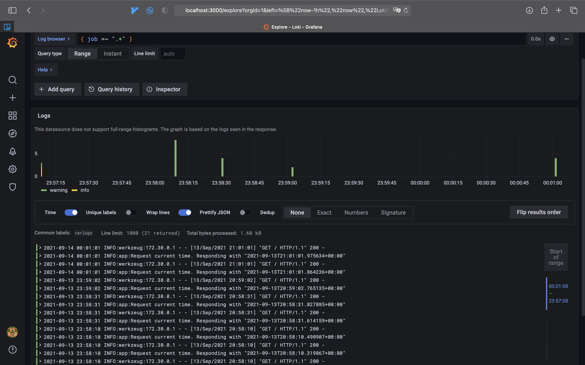

# Logging

1. 
   ```shell
   docker-compose up
   ```
2. Go to http://localhost:5000 and reload the page several times so that some logs are written by the application
3. Go to http://localhost:3000
4. Add datasource http://loki:3100
5. Go to "Explore"
6. Run the query
   ```
   { job =~ ".+" }
   ```

Exemplary output:


